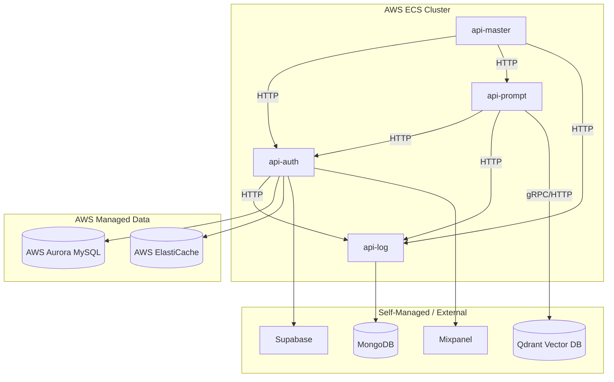

# Project Context & Memory

> **AI Instructions:** This is a living document. Read this at the start of a session to understand the project's high-level goals and architecture. Update this document when you learn new details about the system's structure, dependencies, or workflows. Keep it concise (max 2-3 pages).

## 1. Overarching Goal
**Migration & Modernization**: The primary goal is to migrate the "Budly" AI platform from a monolithic EC2 instance (running Docker containers) to a scalable, cloud-native architecture on AWS.

**Key Objectives:**
1.  **Container Orchestration**: Move 4 core services (`api-auth`, `api-log`, `api-master`, `api-prompt`) to **AWS ECS**.
2.  **Database Migration**: Migrate self-managed MySQL to **AWS Aurora**.
3.  **Cache Migration**: Migrate self-managed Redis to **AWS ElastiCache**.
4.  **Modernization (Phase 2)**: Replace `api-log` with **AWS CloudWatch** and `api-master` with **AWS API Gateway**.

## 2. Architecture & Services

The system currently consists of 4 Python/FastAPI services communicating via HTTP (Port 8000).

*   **`api-master`** (Orchestrator):
    *   Acts as the central gateway/orchestrator.
    *   Routes requests to `api-auth`, `api-prompt`, and `api-log`.
    *   *Future*: To be replaced by AWS API Gateway.
*   **`api-auth`** (Identity & Access):
    *   Handles user authentication, registration, and access control.
    *   Dependencies: MySQL, Redis, Supabase, Mixpanel.
    *   Sends logs to `api-log`.
*   **`api-prompt`** (Core Logic):
    *   Handles the core AI/Chat functionality (RAG, Chat).
    *   Dependencies: `api-auth` (verification), `api-log`, **Qdrant** (Vector DB).
*   **`api-log`** (Logging):
    *   Centralized logging service.
    *   Dependencies: MongoDB.
    *   *Future*: To be replaced by AWS CloudWatch.

### Service Interaction Diagram (Phase 1: ECS Migration)

## 3. Infrastructure & External Dependencies

*   **Infrastructure as Code**: Terraform (located in `budly-terraform/`).
    *   Environments: `Dev` (currently defined).
    *   Key Resources: VPC, ECR Repositories, ECS Cluster, Task Definitions, Service Discovery (`budly.local`).
*   **Databases**:
    *   **MySQL**: Primary relational DB (Migrating to Aurora).
    *   **Redis**: Caching & Session storage (Migrating to ElastiCache).
    *   **MongoDB**: Used by `api-log` (likely transient until CloudWatch migration).
    *   **Qdrant**: Vector Database for RAG and semantic search.
        *   Currently self-managed container.
        *   Used by `api-prompt`.
        *   Collections: `budly_knowledge_hub_v2`, `budly_documents_knowledge`, etc.
        *   Ports: `6334` (gRPC), `6333` (HTTP).
*   **External APIs**:
    *   **Supabase**: Auth/Data.
    *   **Mixpanel**: Analytics.

## 4. Key Workflows & Patterns

*   **Service Discovery**: Services resolve each other using internal DNS (e.g., `http://auth.budly.local:8000`).
*   **Logging**: Services send logs to `api-log` via HTTP POST/PATCH, which writes to MongoDB.
*   **Authentication**: `api-auth` verifies tokens and manages user sessions (Redis/MySQL).
*   **RAG / Search**: `api-prompt` queries **Qdrant** for semantic search and document retrieval.

## 5. Migration Game Plan
1.  **Phase 1 (Current Focus)**: Lift & Shift all 4 services to AWS ECS. Connect them to AWS Aurora and ElastiCache. Ensure internal communication works.
    *   *Note*: Qdrant strategy needs to be defined (Self-hosted on ECS vs Qdrant Cloud).
2.  **Phase 2**: Deprecate `api-log` in favor of native CloudWatch integration. Deprecate `api-master` in favor of AWS API Gateway.
